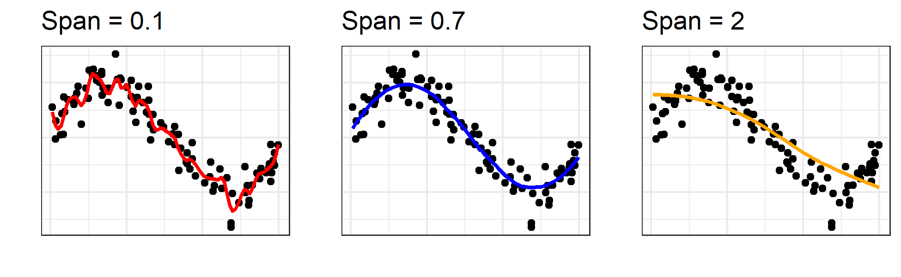
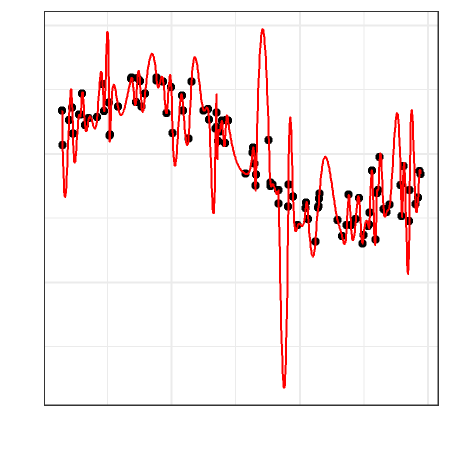
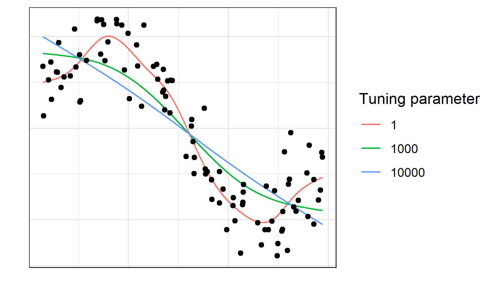
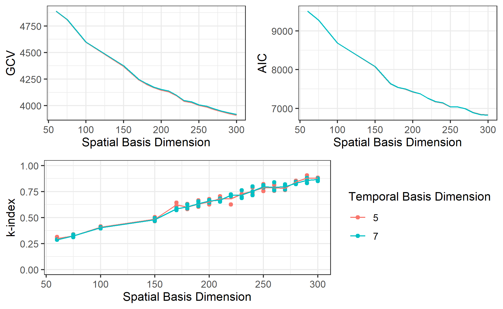
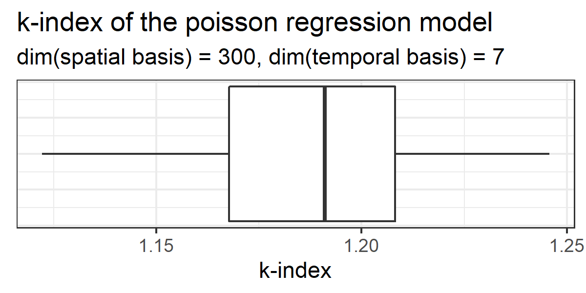
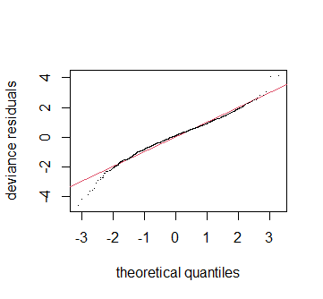
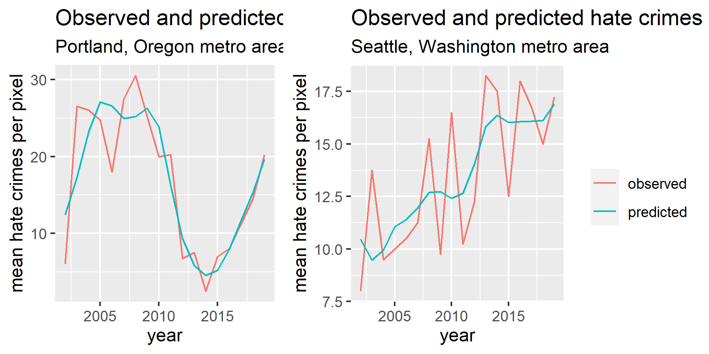
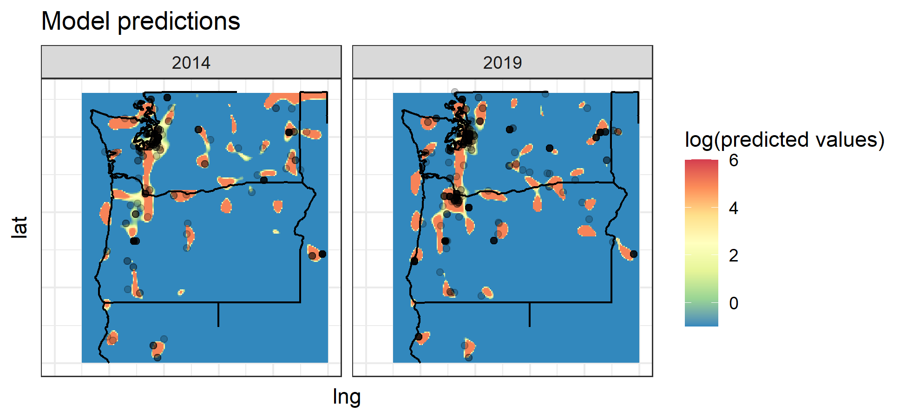

```{r setup, include=FALSE}
knitr::opts_chunk$set(echo = FALSE, cache=TRUE)
library(tidyverse)
library(mgcv)
library(STRbook)
library(gridExtra)
```

# Introduction

[@tidyverse]

Hate cimes are considered as a nonhomogeneous point process, and the intensity funciton is estimated using a Generalized additive model. To accomodate the spatio-temporal nature of the data set, a tensor product smoother is used, using a thin plate regression spline for the spatial domain, and a cubic regression spline for the temporal domain. Due to the overabundance of data, the scope of the investigation was limited to the pacific northwest by filtering the data to be between -125 and -116 degrees of longitude, and between 40 and 49 degrees of latitude. One question of interest concerns the changing political climate of the United States. With the rise in prominence of the "Alt-Right", a loose group of far-right political extremists, has there been an increase in hate crimes in the Pacific Northwest? For this reason the "post 9-11" era was considered, using only the hate crime data from 2002-2019. 


This project was inspired by a data set on hate crimes, collected by the FBI. The data were retrieved from the FBI's Crime Data Explorer website [@fbi]. Hate crimes are events which happen in space and time, which makes them a potential candidate for modeling via a spatio-temporal point process. It has been shown in the past that a marked Hawkes point process can be used to model crimes, with the crimes having the property of self-excitation [@park2019]. At the time of data retrieval, this self-exciting property of crimes was known, and was a part of the motivation behind investigating the data set. However, self exciting point processes such as the Epidemic Type Aftershock Sequence (ETAS) model are notoriously computationally intensive, and the hate crime data set wound up being extremely large. Furthermore, since the location of the crimes needed to be reverse-geocoded, the locations of the data are only an approximation. For these reasons, the self-excitation assumption was dropped, and the scope of the project became modeling the observed counts of hate crimes for a given raster pixel of the spatial domain. 

The FBI data set did not contain data on the specific locations of the crimes that were observed. A "location name" variable was recorded, but this did not include any sort of spatial information like GPS coordinates; instead this variable described the *type* of location where the crime occurred. Examples of locations observed by this variable include values such as "Residence/Home" and "Church/Synagogue/Temple/Mosque". However, there were a few variables that could be used to glean some information about where the crimes occurred; for each crime that was recorded in the data set, information about the public agency reporting the crimes. These variables were the public agency name, the public agency unit, the state name, the agency type, and the division name. The different agency types that reported the crimes were "City", "County", "Other State Agency", "University or College", "State Police", "Other", "Tribal", and "Federal". For each type of agency, the other variables describing the agency could be concatenated into a search string. This search string was then used as a search query using the Google Places API, with the assistance of a function wrapper provided in the R package Googleway [@googleway]. The search results from this process were saved, and the latitude and longitude coordinates were added to the hate crime data set. However, after this first round of reverse geocoding, there were several locations which had issues; either google had not found a location, or google had found two locations. To remedy this, the search strings for these problem locations were used as search queries for OpenStreetMaps using a wrapper from the tmaptools package [@tmaptools].

Describing this feature engineering process reveals an unavoidable weakness of this investigation. The actual locations of where the hate crimes occ urred were not recovered; instead, the locations of the public agency reporting the hate crime were used to approximate the location of the hate crime. Without more information about the crimes themselves, it is hard to see a way around this limitation. Rather than ignoring this limitation and proceeding to treat the coordinates as though they were points from a point placement process, this investigation tried to analyze the data set using a method that wouldn't rely on the points being precise. To accomplish this, a raster grid of pixels with a suitably coarse resolution was drawn, and the number of hate crimes that occurred in each points was approximated by the number of times that an agency in that pixel reported a crime. 

# Methods

## Inhomogenous point process

Speaking extremely roughly, poisson processes are a family of mathematical models that are used to model *things* that happen in space and time, where we represent these things by points, and assume that there's some sort a random element to the way these points are distributed [@kingman1993]. We assume that for a measurable subset of some manifold, the number of points occurring in that subset is modeled by a poisson random variable, where the mean of that poisson random variable is given by the measure of the subset. The simplest example of this sort of model is the homogeneous poisson process, where the mean of the distribution of the number of points occurring in a subset is given by a constant times the Lebesgue measure of that set (the length, area, volume etc. depending on the dimension of the space in question). For instance, we could model the number of calls coming into a call center by letting the space representing time be the real line, and say that the mean number of calls for any interval of time is given by the length of that interval times some rate $\mu$. 

An inhomogenous poisson process is an abstraction from this, where we consider the expected value of the number of points of given interval to be given by the integral of some function over that space. We call this function the intensity function. 

For the hate crime data, clearly the crimes themselves can be considered as points being generated by a stochastic process. However, the exact locations of the crimes were not given in the data set, but instead had to be reverse geocoded using APIs. Because of this, there will be considerable error in the placement of the points themselves. Therefore, rather than considering the points themselves, the spatio-temporal domain of these points will be divided up into bins, and the observed counts of hate crimes within these bins will be modeled. 

## Generalized Additive Models

Generalized additive models are a further abstraction from the linear model, beyond the generalized linear model. We start with the linear model: $Y_i \overset{i.i.d.}{\sim} \mathcal{N}(\mu_i,\sigma^2)$
where
\[
\mu_i = \beta_0 + \beta_1X_{1,i} + ... + \beta_pX_{p,i}
\]
For this model, we must assume that the errors $\varepsilon_i$ are distributed with a normal distribution with mean zero and finite standard deviation. Requiring the errors to be normally distributed is an obvious limitation on this model that we often times want or need to change. Another less obvious problem with this model is that the linear structure limits the response variable Y to having a range of the real numbers, both positive and negative. For some quantities we may want to model, such as proportions, this is unsatisfactory. For these reasons, we abstract from the linear model, and go to the generalized linear model. For this, we assume a different distribution for $Y_i$, having mean $\mu_i$ such that
\begin{equation}\label{gam1}
g(\mu_i) = \beta_0 + \beta_1X_{1,i} + ... + \beta_pX_{p,i}
\end{equation}
where $g()$ is called the link function. Generalized linear models fix the aforementioned problems with linear models, but they come with their own limitations. For one, we are limited in our choice of distribution of $Y$ given $\mu_i$ to a family of distributions called *Exponential Dispersion Models* [@dunn2018]; this is a necessary assumption for the model fitting and inference of GLMs. Secondly, this model assumes that the effect of the explanatory variables $X_j$ on the mean response is *linear*. The move to generalized additive models allows us to relax this linearity assumption, though the exponential family assumption is kept. 

For a generalized additive model, the model equation is as follows:
\[
g(\mu_i) = f_1(X_{1,i}) + f_2(X_{2,i}) + ... 
\]
here, $g(\cdot)$ is still the link function, and $\mu_i$ is still the mean response for the $i^{th}$ observation. In this case, the functions $f_j$ are smooth functions of the covariates; all that's required is that they're smooth. The value of specifying the model this loosely is that it allows for the functions of the covariates to be specified in flexible ways. One of the functions can even take more than one of the covariates as an input:
\[
g(\mu_i) = f_1(X_{1,i}) + f_2(X_{2,i},X_{3,i}) + ...
\]

Depending on how the individual $f_j$s are specified, the procedure of fitting a generalized additive model varies a bit. Some approaches involve breaking up the domain of an explanatory variable into different regions separated at values called *knots* [@green1994]. Typically, these functions are estimated by creating a linear space of functions of the same variable, then finding a suitable combination of the basis for this linear space to estimate $f_j(\cdot)$.

One issue that GAMs run into is the *bias/variance trade-off*. The idea behind the bias/variance trade-off was stated as:
> estimation error can be decomposed into two components, known as bias and variance; whereas incorrect models lead to high bias, truly model-free inference suffers from high variance

The authors of this statement [@geman1992] characterize this trade-off as being a choice between two models. One model, by not presuming too much about the structure of the underlying relationship, achieves low degree of bias in estimation at the cost of being more variable. The other model avoids being too variable, which can cause overfitting, at the cost of capturing too little information about the underlying relationship. 



Traditionally, the bias/variance trade-off was regarded as an immutable fact of modeling data generating processes, one which causes complex models to suffer from overfitting. However there has recently been some criticism of this [@neal2019], arguing that while it is accurate for some models (such as the one in the above figure), it is not as universal a problem as once thought.  

Although this bias/variance trade-off can be a nuisance when training machine learning models, it provides a natural motivation for a type of GAM smoother called a penalized regression spline. 

- Where are they used? For what applications?

## Cubic Regression Splines

Consider the problem where Y is generated by a smooth function of a single explanatory variable, plus some error term, such that
\[
Y = g(X) + \varepsilon
\]
Given a set of observations, **X** and **Y**, we wish to recover the smooth function $g(\cdot)$. Naively, we may seek to minimize the sum of the squared errors, just as with linear regression:
\[
minimize \;\; \sum_{i=1}^{n} (Y_i - \hat{g}(X_i))^2 
\]
However, doing to produces an *interpolation spline* [@green1994]. This smooth curve will connect all of the points in our dataset together, but it will be a curve with extreme amount of variance.

<div style="float:right">

</div>

In terms of the bias/variance trade-off, interpolation splines lean all the way towards "low bias high variance", which produces curves like the one above, which are not particularly helpful for estimating $g(\cdot)$. They "wiggle" back and forth too much, and when used to try and recover a "signal" by smoothing away noise, they can produce artifacts where the spline goes way outside the range of where points are being observed. To mitigate this, we can penalize the amount of "wiggling" that the curve does. We note that the more the curve wiggles back and forth, the more regions the curve spends with high curvature. Intuitively, we can penalizing this by penalizing the square of second derivative, since we wish to penalize strong positive curvature, and strong negative curvature. The minimization problem then becomes: 
\[
minimize \;\; \sum_{i=1}^{n} (Y_i - \hat{g}(X_i))^2 + \lambda \int_{\mathbb{R}} (\hat{g}''(x))^2dx
\]
As outlined by @green1994, an algorithm to solve this minimization problem and obtain a smooth estimate of $g(\cdot)$ was pioneered by @reinsch1967. An implementation of cubic regression splines is available in the mgcv package [@mgcv]. 



A quick simulation study in R can show us the effects the tuning parameter has on the estimated function $\hat{g}(\cdot)$. As the tuning parameter goes to infinity, the roughness penalty becomes so large that fit curve becomes a line. As the roughness penalty becomes smaller and smaller, more "wiggling" is permitted, and we get a more flexible spline. As the tuning parameter goes to zero, the spline is allowed to wiggle with no limit, and a cubic _interpolation_ spline is achieved 

Another approach to cubic regression splines is a *knot based* approach, where the domain of the x variable is broken up into discrete regions, separated by points called *knots*. In fact, splines fit using the Reinsch algorithm will also have knots, but the knot locations are not specified ahead of time. It is possible through the use of basis functions to fit a cubic regression spline without specifying the tuning parameter $\lambda$, but instead specifying the dimention of the space spanned by the basis functions, which is the same as specifying the number of knots to be used [@wood2017]. However, the advantage of using the penalized cubic regression spline is that it allows us to control explicitly the degree of the bias/variance trade-off we want to achieve with our model. 

## Thin Plate Regression Splines

A useful basis function for the spatial component of a spatio-temporal process is a thin plate regression spline. A thin plate regression spline is a type of regression smoother that has the advantage of not needing to have knot locations specified, as a cubic regression spline does. To understand the motivation of the thin plate regression spline, we must first explore a closely related concept: the thin plate spline. 

Suppose the observations $y_i$ are generated by a smooth function $g(\textbf{x}_i)$ where $\textbf{x}_i$ is a d-vector of explanatory covariates, with some noise term $\varepsilon_i$:
\[
y_i = g(\textbf{x}_i) + \varepsilon_i
\]
The goal of smoothing is to estimate the function $g(\cdot)$ given a set of n observations $y_i$ and $\textbf{x}_i$. For cubic regression splines, what we as data scientists and statisticians are doing is saying to ourselves "I may not be able to recover $g(\cdot)$ exactly, however, I can create a function that is *reasonably close* by fitting a cubic regression spline to these data". Very rarely do we believe that the coefficients of a cubic regression spline carry real world meaning; the purpose of the coefficients is to create a function which makes "*reasonable*" estimations based on a set of data. Thinking in this way, we may decide it is worth it to abstract one step further, moving away from the cubic spline structure and creating a smoother that is based purely on making the estimates as "reasonable" as possible. 

With this in mind, we can define the thin plate spline by letting $\mathcal{F}$ be the set of all smooth functions in $\mathbb{R}^d$, and finding the $f\in\mathcal{F}$ which minimizes:
\begin{equation}\label{tps1}
||\textbf{y} - f||^2 + \lambda J(f)
\end{equation}
$||\cdot||$ is the euclidean norm; note that it makes the first part of this function penalize deviation between predicted response and observed response. If this deviation were the only thing in this equation being minimized, it would produce a model which overfits the date. To combat this, the term $\lambda J(f)$ is added to penalize the selection of the function f. Some authors describe this function as a penalty of "wiggliness" [@wood2017]; it is defined as 
\begin{equation}\label{wiggly}
J(f) = 
  \int_{\mathbb{R}^d} 
    \sum_{\nu_1 + ... + \nu_d}
      \frac{m!}{\nu_1!...\nu_d!}\left(\frac{\partial^m f}{\partial x_1^{\nu_1}...\partial x_d^{\nu_d}}\right)^2dx_1...dx_d
\end{equation}
Here, m is chosen so that $2m>d$. 
This function will penalize the minimization problem for functions which are too "wiggly", which counteracts the tendency of the euclidean norm to select models that over-fit the data. As an example, in the case where d=1 the penalty (\ref{wiggly}) becomes $J(f) = \int_\mathbb{R} [f''(x)]^2dx$ and the resulting solution to (\ref{tps1}) is a the *natural cubic spline* that we saw in the previous section is achieved [@fang2015].

It can be shown [@wood2002] that the solution to this minimization problem takes the form 
\begin{equation}\label{tps2}
g(\textbf{x})=\sum_{i=1}^{n}{\delta_i\eta_{md}(||\textbf{x}-\textbf{x}_i||)} + \sum_{j=1}^{M}\alpha_j \phi_j(\textbf{x})
\end{equation}
See [@wood2002] for more details, but there are a few things that are important to note. First, see that the $\alpha_j$s and $\delta_i$s are coefficients that we wish to estimate. $\nu_{md}$ is a function of a specific form, determined solely by $d$ and $m$, being defined on the positive real numbers. This function takes as its input the euclidean distance between an input point in $\mathbb{R}^d$ and one of the observations $\textbf{x}_i$, giving each point a weighted, isotropic effect on the estimated function. The $\phi_j$s are linearly independent polynomials which span the space of polynomials with degree less than m on $\mathbb{R}^d$, and $M$ is the dimension of the polynomial space, which is given by $M=$${m+d-1}\choose{d}$ [@bates1986]. The estimation problem is now a search for the set of the weights on these two different types of functions, $\{\delta_i\}$ and $\{\alpha_j\}$. If we define the matrix **E** by $E_{ij} = \eta_{md}(||\textbf{x}_i-\textbf{x}_j||)$ and the matrix **T** by $T_{ij} = \phi_j(\textbf{x}_i)$, the minimization problem takes the form:
\begin{equation}\label{tps3}
\underset{\text{\boldmath$\alpha$,\boldmath$\delta$}}{\text{argmin}}||\textbf{y} - \textbf{E}\text{\boldmath$\delta$} - \textbf{T}\text{\boldmath$\alpha$}||^2
+\lambda \text{\boldmath$\delta$}'\textbf{E}\text{\boldmath$\delta$}
\quad\text{subject to the constraint }\textbf{T}'\text{\boldmath$\delta$} = 0
\end{equation}

In addition to having an intuitive motivation, thin plate splines have a couple of benefits [@wood2017]. For example, they are isotropic, meaning that the resulting function will be the same of the orientation of the bases of $\mathbb{R}^d$. However, they come at an incredible cost in terms of computation speed. This prompts the question "can we create a function that decently approximates a thin plate spline, but with low rank, while still retaining the useful properties of a thin plate spline?" The answer is yes: enter the thin plate *regression* spline. 

The idea behind a thin plate regression spline is to modify \ref{tps3} to create a low-rank, more computationally efficient approximation. This is accomplished by taking the eigen-decomposition of **E** with $\textbf{E} = \textbf{UDU}'$, such that D is a diagonal matrix of eigenvalues of **E** such that $|D_i,i|\geq |D_{i-1,i-1}|$ for all $i\in\{2,3,...n\}$, meaning the diagonal is in ascending order of absolute value from top-left to bottom-right. The trick is to replace **E** by truncating **U** and **D**; we denote the matrix consisting of the first k eigenvectors by $\textbf{U}_k$ and we denote the diagonal matrix with the corresponding eigenvalues as $\textbf{D}_k$. Note that to do this we just take the first k columns from **U** and the top left $k\times k$ submatrix of **D**. Since $\textbf{U}_k$ is a $k\times n$ matrix, we can restrict \boldmath$\delta$ to the column space of $\textbf{U}_k$ by writing it as $\textbf{U}_k\text{\boldmath$\delta$}_k$. With this, the minimization problem becomes 
\begin{equation}\label{tprs1}
\underset{\text{\boldmath$\alpha$,\boldmath$\delta$}}{\text{argmin}}
  ||\textbf{y} - \textbf{U}_k\textbf{D}_k\text{\boldmath$\delta$}_k - \textbf{T}\text{\boldmath$\alpha$}||^2
  +\lambda \text{\boldmath$\delta$}_k'\textbf{D}_k\text{\boldmath$\delta$}_k
\quad\text{subject to the constraint }\textbf{T}'\textbf{U}_k\text{\boldmath$\delta$}_k = 0
\end{equation}

Wood goes into more deail of how the R package mgcv minimize this equation under the constraint [@wood2017], but the important part to recognize is that once the $\text{\boldmath$\delta$}_k$ is estimated, the full $\text{\boldmath$\delta$}$ is retrieved by a single matrix multiplication operation, the $\text{$\delta$}$ can be used with **E** to estimate \unboldmath$g(\cdot)$. 

## Tensor Product Smoothers

After looking at the properties of cubic regression splines and thin plate regression splines, it makes intuitive sense that a thin plate regression spline would be appropriate for the spatial component of the hate crime data set, and a cubic regression spline would be appropriate for the temporal component. The question becomes how we are to combine these two components together in a single model. A convenient solution for this problem is the *tensor product smoother.* In fact, tensor product smooths are such a natural solution for this problem that @wood2017 cites "a smooth function of a single spatial coordinate and time" as a motivating example for tensor product smooths. Lab 4.4 of @winkle2019 uses a tensor product smooth of a two-dimensional spatial domain and a temporal domain explanatory variables to model count data for Carolina Wrens; this example is so similar to the hate crime data set that it is the motivation for this project.

As some have commentators have noted, the theory, axioms, and definitions that go into defining tensors can be quite terse [@tensorphobia]. However, there is one property that makes tensor product smoothers a good choice for combining these basis spaces together: *multiliniarity*. A function of *k* vector arguments is said to be multilinear if it is linear in each of its arguments, *when all other arguments remain fixed* [@shilov1977]. This desirable property, which the addition of tensors has, is what helps mitigate the scaling issue of combining two bases. As @wood2017 puts it, 
\begin{quote} 
consider a smooth function of a single spatial coordinate and time: the implied relative importance of smoothness in time versus smoothness in space is very different between a situation in which the units are metres and hours, compared to that in which the units are lightyears and nanoseconds.
\end{quote}
The multilinarity of tensors allows us to combine these two bases in an elegant way which solves this issue.

Currently, we have a basis for a vector space of functions, where the functions are of time, and some linear combination of these functions gives us a smooth estimate of $g(t)$. We have the same thing for the spatial domain, where the thin plate regression spline fitting algorithm outlined in @wood2002, used in the mgcv package [@mgcv], is a search for an optimal linear combination from "an optimal approximating basis". To bring these two smooths together, we need to somehow unite the vector spaces formed by the basis functions. This task of uniting two vector spaces is where the tensor product is employed in a tensor product smooth. 

Let $\textbf{S}$ be the spatial domain; i.e. the set of  latitude and longitude points in our data set of hate crime counts. Let $\textbf{T}$ be the temporal domain, i.e. what year it is. Denote points in these domains by $(x,y)\in\textbf{S}$ and $t\in\textbf{T}$. Let $\{f_i(x,y)\}_{i=1}^{I}$ be the set of basis functions to smooth over the spatial domain and let $\{h_j(t)\}_{j=1}^{J}$ be the set of basis functions to smooth over the temporal domain. Then the marginal smooths for $g(\cdot)$ over these two domains is given by
\[
{g}_t(t) = \sum_{j=1}^J \alpha_j h_j(t)
\quad\text{and}\quad
{g}_{x,y}(x,y) = \sum_{i=1}^J \beta_if_i(x,y)
\]
Where the $\alpha_j$ and $\beta_j$ are coefficients we solve for. Then, we can combine the smooths over these two domains by 
\[
g_{x,y,t}(x,y,t) = \sum_{i=1}^I \sum_{j=1}^J \delta_{ij}f_i(x,y)h_j(t)
\]

The linear combination of $\delta_{ij}$ coefficients and the basis function products $f_i(x,y)h_j(t)$ form a special kind of vector space called a *tensor space*. This tensor space is now the space that is being optimized over, we minimize ordinary least squares as in equation (\ref{tprs1}). However, to do this we must adapt the roughness penalties of the marginal basis smoothers to be compatible with the tensor product smooth. To do this, we first denote the roughness penalties on the cubic spline and the thin plate regression spline by $J_t(g_t)$ and $J_{x,y}(g_{x,y})$ respectively, and let them be as defined as in equation (\ref{wiggly}). Next, we define $g_{t|x,y}(t)$ to be the function $g_{x,y,t}(x,y,t)$, considered only as a function of $t$, holding x and y constant. Similarly define $g_{x,y|t}(x,y)$ as a function of $(x,y)$. Then, the roughness penalty function for $g_{x,y,t}(x,y,t)$ is given by 
\begin{equation}\label{tensorpenalty}
J(g_{x,y,t}) = 
\lambda_t \int_{(x,y)} J_t(g_{t|x,y})dxdy + 
\lambda_{x,y} \int_{t} J_{x,y}(g_{x,y|t}) dt
\end{equation}
As @wood2006 points out, the torrent of subscripts in this equation can obfuscate the meaning a bit. One way to think of this is to consider that since $g_{x,y,t}(x,y,t)$ will produce an entire cubic spline for each point $(x,)$, we need to not just penalize one of these cubic splines, we need to penalize the cubic spline *for every point* $(x,y)$ *in the spatial domain*. To accomplish this "penalization everywhere", we integrate "temporal marginal roughness penalty" across the entire spatial domain. This is what is meant by $\lambda_t \int_{(x,y)} J_t(g_{t|x,y})dxdy$, the converse explains the other term in equation (\ref{tensorpenalty}). 

With the basis functions and penalty defined, the only task left is to estimate the coefficients, which can be done using the same methods used to estimate coefficients for the marginal smooths.

## Generalized Cross Validation 

So far, we've developed the machinery required to estimate the smooth function of $g(\cdot)$ *presuming we know the tuning parameter* $\lambda$. The basis dimensions k must be determined as part of the model specification, and the reasonability can be checked by a randomized test that @wood2017 briefly outlines, which is implemented in `mgcv` as `gam.check()`. This leaves a large question unanswered though: how are we to choose the smoothing parameter $\lambda$? Fortunately, or perhaps unfortunately, `mgcv` makes this smoothing parameter selection process so effortless that you would not even know it's happening without an understanding of the theory behind GAMs. 

To select a value for $\lambda$, we simply choose an optimality criterion, and numerically optimize $\lambda$. As @wood2017 describes, there are a number of optimality criteria to choose from, but for the scope of this project we will stick to the optimality criterion that is the default in `mgcv`, namely generalized cross validation (GCV).

@craven1978 defined generalized cross-validation, as a function of $\lambda$, by 
\begin{equation}\label{gcv}
V(\lambda) = 
  \frac{||(I - A(\lambda))\textbf{Y}||^2}
       {n\left[\frac{1}{n}tr(I-A(\lambda))\right]^2}
\end{equation}
where $\textbf{Y}$ is the vector of observed responses, and $A(\lambda)$ is the $n\times n$ matrix satisfying $(\hat{g}(\textbf{x}_1),...,\hat{g}(\textbf{x}_n)^t = A(\lambda)\textbf{Y}$ (we would nowadays call this the hat matrix). They defined the estimate $\lambda$ that minimizes $V(\lambda)$ as the generalized cross-validation estimate, $\hat\lambda$. The advantage of using GCV is that it does not require knowledge of whatever dispersion parameter is being used for the distribution of Y. 

As @wood2017 points out, the generalized cross-validation estimate is often consistent with choices for $\lambda$ that are found based on other optimality criteria. Unless otherwise specified, `mgcv` automatically selects $\lambda$ based on this optimality criterion. 

# Results

## model selection

Since $\lambda$ is chosen using the Generalized Cross Validation as an optimality criterion, all that remains is to specify the basis dimensions for the spatial and temporal marginal smooths. The question remains as to how these basis dimensions are to be specified. Initially, naively, the intuitive approach was to use AIC or GCV as optimality criteria, and find a basis dimension that minimized one or both of them. However, fitting several models with varying basis dimensions showed no signs of achieving a minimum for either optimality criterion. Model fitting times were becoming untenable, and it became clear that there was no reason to assume that either optimality criterion would achieve a minimum before the saturated model was fit. 

Fortunately, @wood2017 outlines a randomized diagnostic test to check if the basis dimensions are large enough, and he included an implementation of this test in `mgcv`. Since it was randomized, three replicates were taken for each combination of the values of spatial and temporal basis dimension were made to get an idea of the spread. This randomized test statistic is called the k-index; @mgcv suggests that models which produce a k-index above 1 will be sufficiently fit, and that models with a k-index below 1 might be underfit. 


From this process, we learn that AIC and GCV may not be particularly helpful in telling us when the basis dimensions are large enough to capture the pattern of the data. Furthermore, even with 300 spatial knots and 7 temporal knots the k-index of the model was below 1. At this point it seems that the amount that the basis dimension of the model is going to need to be raised to an unreasonable degree to achieve the desired k-index.

These models (those in the above figure) were fit using a negative-binomial family for the error term of the model. It was assumed that this would be a better fit than a poisson model, which can suffer from underdispersion. At this point, a poisson model was fit using a spatial basis dimension of 300, and a temporal basis dimension of 7. This model, surprisingly, had a k-index that was consistently above 1, and with a higher percentage of deviance explained by the model than with the negative-binomial model. 



The reson that this model selection procedure was not repeated is that these models take an extraordinary length of time to fit. The final model, using a poisson family for the errors, with a spatial basis dimension of 300, and a temporal dimension of 7 took 8 hours to fit on a quad-core 1.8GHz processor with 16GB of memory. 

## Diagnostics


As is usually the case with residual analysis of GAMs and GLMs, residual analysis was a bit difficult. Fortunately the `mgcv` package includes a function for constructing quantile-quantile plots for GAM objects. These residuals show a fit that deviates from the reference line somewhat, but it is not too egregious. 



A decent degree of temporal smoothing was achieved. In Portland, hate crimes were on the decline from 2009 to 2014, then took a sharp rise from 2015 onward. In Seattle, a steady upward trend in reported hate crimes was observed. 



Plotting the spatial component of the model was also informative. Differences in hate crime rates can be seen by comparing the fitted values for the geographic area of interest for two different years. 



In this plot we can see the increase in the hate crime rate for Portland. Also of interest are several artifacts produced by model fitting; off the northwest coast of Oregon, near Astoria, a large patch of the pacific ocean has high predicted hate crime counts, but (obviously) no observed crimes. 

# Discussion and Conclusion

It was suspected that there would be an increase in hate crimes correlated with changes in the US political climate between 2014 and 2019. While this was noticed in some locales (i.e. Portland) it was not universal (i.e. Seattle). In the Portland metro area, this rise in hate crimes coincided with the expansion of the Portland metro area's "hotspot" as fitted by the model. 

Part of the goal of this project was to test the waters of using GAMS as a means of estimating the intensity of an inhomogenous poisson process. At this time, we cannot advise doing so. The process of finding an adequate model expression for the GAM was obscenely time consuming, which is a factor that some point-process applications already suffer from. Furthermore, the fit of the model to the data was not that great; there were several regions of the map that had high "fitted intensity" despite seeing no points. 

At this point, we are hestitant to form strong conclusions based on this data. The exact locations of the hate crimes were not recoverable; although approximate locations could be recovered by reverse geocoding the location of the reporting agency, this approximation is very optimistic. For instance, if the Oregon State Police have their headquarters in Portland, a crime committed near Redding that was reported by the State Police would be added to Portland's hate crime count. However, recognizing this severe limitation of the data set, this provided a decent opportunity to investigate the use of GAMs, smoothing splines, and tensor products. 

# References

